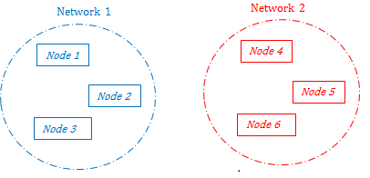
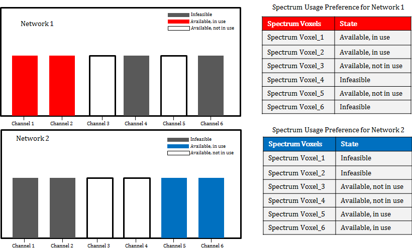
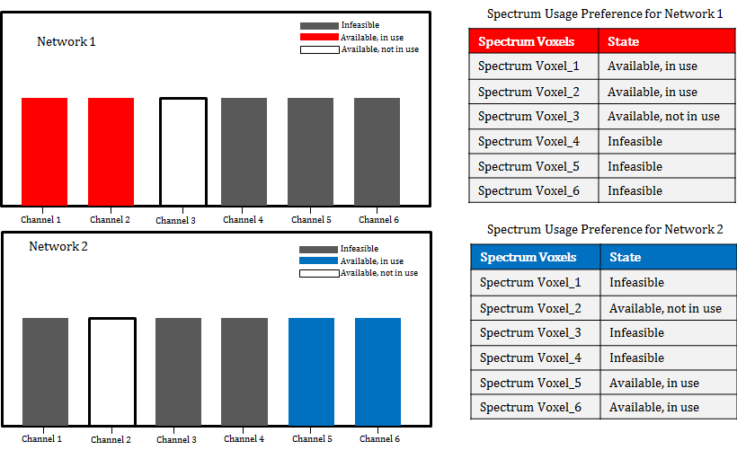
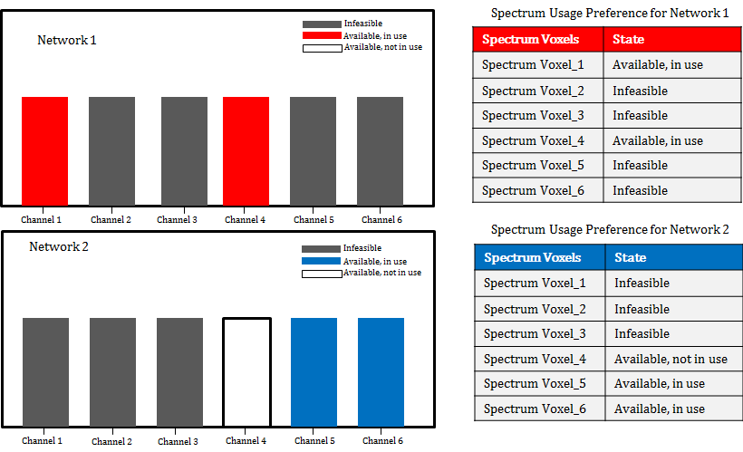

# Scenario explaining the need for a Spectrum Usage Preference construct. 

## Table of Contents
* [Scenario Motivation](#motivation)
* [Scenario Technical Introduction](#introduction)
* [Detailed Message Exchange](#message-exchange)
* [Scenario Conclusion](#conclusion)

## Motivation
Given the fact that the CIRNs do not know the internal mechanisms of other networks, a noun class that helps CIRNs avoid
 using channels that are (1) currently being used and/or (2) preferred and will be used by a neighboring CIRN would 
be very indispensable. It will significantly reduce the sensing and processing efforts as well as Performance message exchanges to learn if a channel is occupied by another CIRN or we are creating a lot of interference.
As a result of this, we propose the **Spectrum Usage Preference** noun construct (an updated version of 
the non-preferred/preffered channel list) which can help to mitigate 
possible cross-network interference. If such situations are not taken care of via collaboration, the interference might cause 
impairment in network throughput and performance. Sharing spectrum preferences with other networks would not only prevent 
interference issues, it will also give room for CIRNs to collaboratively improve other CIRNs' performance and throughput via negoatiation over the channels.
We note that the proposed noun is defined at the **network level**, in contrast to PSD and spectrogram that are defined for a specific node or location. 
Spectrum Usage Preference is a processed piece of information and can embody the policies or requirements of the network as a whole, not a specific node.

Three use-cases are provided in this scenario to further explain how Spectrum Usage Preference can be used to achieve this goal.

## Introduction

In this scenario, we show how exchanging what channels are potentially available but are in use (unavailable) and what channels are infeasible to use would help to prevent interference and also 
improve the performance of a CIRN. We propose that this noun class be 
used as a resource message. We leverage Spectrum Voxel construct under Resources to partition the spectrum in time time and frequency, but we propose adding a new dimension (sub-component) to it 
 that we call 'state'. The state contains expressive information about the state of the availability of a channel (defined in time and frequency).
A state can take one of the following values: infeasible to use, available but in use (preferred channel), and available but not in use. When a channel is 
infeasible, it could imply it is occupied by incumbents, or the noise/interefence level in that channel is so high that the reporting CIRN cannot use it. 
When a channel is available and in use, it could imply that it is currently being used by the reporting CIRN (probably a node in that network) until the specific end time. 
When a channel is available and not in use, it could imply that it is unoccupied and could be used by an interested node.

Hence, the updated Spectrum Voxel is used to describe each channel in time, frequency, transmit power and state. Then we propose Spectrum Usage 
Preference as list of such Spectrum Voxels. In all the use-cases below, we use the state content to 
ascertain the availability or infeasibility of a channel. We theorize that the content of the state sub-component is generated 
based on the wireless environment and a collection of historical data on each channel as observed by the network.
Since the Spectrum Usage Preference is exchanged between both networks, they can all see what channel is available, unavailable 
or infeasible to other CIRNs at their network-wide level. Therefore, sharing a list of Spectrum Usage Preference would be very useful for identifying 
the future channels that a network can use. The Spectrum Usage Preference is a dynamic list that is subject to change depending on the wireless environment.

**Network Laydown**

## Message Exchange

1.  CIRN 1 (N1) sends CIRN 2 (N2) Hello : I support
    *   MAKE_DECLARATION messages with DEMAND, RESOURCE, PERFORMANCE, OBSERVATION and CAPABILITY types
	*	REQEUST_YOUR_DEMAND messages 
    *   DEMAND types THROUGHPUT, PRIORITY, SPECTRUM_USAGE_PREFERENCE
    *   RESOURCE type SPECTRUM VOXEL
    *   PERFORMANCE types SCALAR_PERFORMANCE, BIT_ERROR_RATE and FRAME_LOSS_RATE
    *   OBSERVATION types PSD, SPECTOGRAM and LOCATION
	*	CAPABILITY types CHANNELIZATION and NUMBER_OF_ANTENNAS

2.  N2 sends N1 Hello : I support
    *   MAKE_DECLARATION messages with DEMAND, RESOURCE, PERFORMANCE, OBSERVATION and CAPABILITY types
	*	REQEUST_YOUR_DEMAND messages 
    *   DEMAND types THROUGHPUT, PRIORITY, SPECTRUM_USAGE_PREFERENCE
    *   RESOURCE type SPECTRUM VOXEL
    *   PERFORMANCE types SCALAR_PERFORMANCE and BIT_ERROR_RATE
    *   OBSERVATION types PSD, SPECTOGRAM and LOCATION
	*	CAPABILITY types CHANNELIZATION and NUMBER_OF_ANTENNAS

3.	It can be seen from this message exchange that they both support the same demand, resource,
	observation and capability messages with only a different performance message.

4.	At the start of their communication, they both experience the best network performance as 
	seen in the exchange between them below.

5.  N1 sends N2 **MakeDeclaration**: 
    *   My Demand::Throughput is 11Mbps.
    *   I am using RESOURCE:: Spectrum Voxel which use 30dBm
    *   My Performance:: Scalar Performance metric is 1.0 from time 0 to 5 seconds.
	*	My Capability:: Channelization : min_chans = max_chans = 2
	*	My capability:: Number of Antennas is 2

6.  N2 sends N1 **MakeDeclaration**: 
    *   My Demand::Throughput is 9Mbps.
    *   I am using RESOURCE:: Spectrum Voxel which use 30dBm
    *   My Performance:: Scalar Performance metric is 1.0 from time 0 to 5 seconds.
	*	My Capability:: Channelization : min_chans = max_chans = 2
	*	My capability:: Number of Antennas is 2

**Use-Case #1**: 

In this use-case, N2 experiences a performance degradation and wants to move to another channel but find out that the 
channel is occupied by another node from another network. It then moves to another available (and not in use) channel.

7.	We look at the first use case in which N2 experiences a significant degradation in performance 
	in one of its currently occupied channels. Both networks exchange their prtformance metric as shown 
	below. 

8.	N1 sends N2 **MakeDeclaration**: from time 5 to 10 seconds:
	*	My Performance:: Scalar Performance metric is 1.0

9.	N2 sends N1 **MakeDeclaration**: from time 5 to 10 seconds:
	*	My Performance:: Scalar Performance metric is 0.6
	
10.	In a bid to improve N2's performance, it requests for the demands of N1 and also declares 
	its own demand. Requesting the demand of N1 helps N2 to determine which channel it can move 
	to in order to improve its performance. Figure 2 shows the channel allocation and the Spectrum Usage Preference 
	for both networks.

**N1 and N2's Spectrum Usage Prefernce (Use Case #1)**

	
11.	N1 sends N2 **RequestYourDemand** and also send its own demand by using **MakeDeclaration**:
	*	My demand : Spectrum Usage Preference: 	
	    *	Spectrum_Voxel_1: Available, in Use
		*   Spectrum_Voxel_2: Available, in Use
		*   Spectrum Voxel_3: Available, not in use
		*   Spectrum_Voxel_4: Infeasible
		*   Spectrum_Voxel_5: Available, not in use
		*   Spectrum_Voxel_6: Infeasible
12.	N2 sends N1 **RequestYourDemand**:
	*	My demand : Spectrum Usage Preference: 	
	    *	Spectrum_Voxel_1: Infeasible
		*   Spectrum_Voxel_2: Infeasible
		*   Spectrum Voxel_3: Available, not in use
		*   Spectrum_Voxel_4: Available, not in use
		*   Spectrum_Voxel_5: Available, in use
		*	Spectrum_Voxel_6: Available, in use

13.	N2 can leverage the information in its own Spectrum Usage Preference to know which channel would give a
	better performance. Suppose that channels 2 and 3 are the 
	most beneficial for N2. Before choosing a new channel, it checks N1's Spectrum Usage Preference 
	and immediately sees that channel 2 is in use while channel 3 is available. 

14.	N2 can then move to channel 3 for a better performance and avoid creating interference at channel 2. They can then exchange another information about 
	their network performance. 

15.	N1 sends N2 **MakeDeclaration**: from time 5 to 10 seconds:
	*	My Performance:: Scalar Performance metric is 1.0

16.	N2 sends N1 **MakeDeclaration**: from time 5 to 10 seconds:
	*	My Performance:: Scalar Performance metric is 0.9

17.	It can be observed that if peradventure, channel 3 does not provide a better performance, N2 can 
	**negotiate** with N1 to have it vacate channel 2 and move to another available channel. The tradeoff here is that moving to 
	either channel 2 or 3 provides almost the same benefit for N1.

 **Use-Case #2**:
 
In this use-case, N2 experiences a more devastating network degradation, it first sees an available channel but on consulting with N1, 
it discovers that the channel is available and in use. N1 however agrees to change its channel so as to help N2 recover from the degradation.
However, N1 suffers a mild degradation in performance when it changes its channel.
18.	We consider a second use-case in which N2 experiences severe degradation in performance, this time the performance 
	very degraded as seen in their exchange below;

19.	N1 sends N2 **MakeDeclaration**: from time 20 to 25 seconds:
	*	My Performance:: Scalar Performance metric is 0.9

20.	N2 sends N1 **MakeDeclaration**: from time 20 to 25 seconds:
	*	My Performance:: Scalar Performance metric is 0.3

21.	As in the first scenario, they both exchange their Spectrum Usage Preference in the message exchange below:

22.	N1 sends N2 **RequestYourDemand** and also send its own demand by using **MakeDeclaration**:
	*	My demand : Spectrum Usage Preference: 	
	    *   Spectrum_Voxel_1: Available, in Use
		*   Spectrum_Voxel_2: Available, in Use
		*   Spectrum Voxel_3: Available, not in use
		*   Spectrum_Voxel_4: Infeasible
		*   Spectrum_Voxel_5: Infeasible
		*   Spectrum_Voxel_6: Infeasible
23.	N2 sends N1 **RequestYourDemand**:
	*	My demand : Spectrum Usage Preference: 	
	    *	Spectrum_Voxel_1: Infeasible
		*   Spectrum_Voxel_2: Available, not in use
		*   Spectrum Voxel_3: Infeasible
		*   Spectrum_Voxel_4: Infeasible
		*   Spectrum_Voxel_5: Available, in use
		*   Spectrum_Voxel_6: Available, in use
    
24.	Again, suppose that the internal processing in N2 specifies that channel 2 would boost its network performance and 
	on checking through its own list channel 2 is available and not in use, but N1’s list shows it to be in use. 
	Without checking N1's list, N2 would have moved to channel 2 just because it appears not to be
	in use, which could lead to interference for both networks. Figure 3 shows the Spectrum Usage Preference for both networks.

**N1 and N2's Spectrum Usage Prefernce (Use-Case #2)**	

25.	Based on data available to N1, channel 3 would cause it to suffer a mild degradation. However, for the sake of 
	collaboration and improvement of N2’s performance, N1 could vacate channel 2 and move to channel 3 which is 
	not in use.
	
26.	N1 sends N2 **MakeDeclaration**: from time 25 to 30 seconds:
	*	My Performance:: Scalar Performance metric is 0.8

27.	N2 sends N1 **MakeDeclaration**: from time 25 to 30 seconds:
	*	My Performance:: Scalar Performance metric is 0.7
	
28.	This use-case shows how collaboration can be leveraged to improve the performance of a network. Even though, the performance 
	of N1 has not been improved, it has collaborated with N2 to ramp up its (N2) performance. 
   
**Use-Case #3** :

In this use-case, N2 wants to change it's channel, but cannot because N1 has no available channel to move to so as to accomodate N1.

29.	N1 sends N2 **MakeDeclaration**: from time 40 to 45 seconds:
	*	My Performance:: Scalar Performance metric is 0.9

30.	N2 sends N1 **MakeDeclaration**: from time 40 to 45 seconds:
	*	My Performance:: Scalar Performance metric is 0.6

31.	As in the previous two use-cases, they both exchange their Spectrum Usage Preference in the message exchange below:

32.	N1 sends N2 **RequestYourDemand** and also send its own demand by using **MakeDeclaration**:
	*	My demand : Spectrum Usage Preference: 	
		*	Spectrum_Voxel_1: Available, in Use
		*	Spectrum_Voxel_2: Infeasible
		*	Spectrum Voxel_3: Infeasible
		*	Spectrum_Voxel_4: Available, in use
		*	Spectrum_Voxel_5: Infeasible
		*	Spectrum_Voxel_6: Infeasible
33.	N2 sends N1 **RequestYourDemand**:
	*	My demand : Spectrum Usage Preference: 	
		*	Spectrum_Voxel_1: Infeasible
		*	Spectrum_Voxel_2: Infeasible
		*	Spectrum Voxel_3: Infeasible
		*	Spectrum_Voxel_4: Available, not in use
		*	Spectrum_Voxel_5: Available, in use
		*	Spectrum_Voxel_6: Available, in use

Figure 4 explains the use-case 3. 

**N1 and N2's Spectrum Usage Prefernce (Use Case 3)**

34.	In this use-case, N2 experiences some degradation in network performance on one of its currently occupied 
	channel, when it looks at its Spectrum Usage Preference, it discovers that channel 4 would serve it better, however, channel 4
	is been used by N1 and given that N1 has no other channel to move to, N2 would have to refrain from 
	occupying channel 4 even when it seems available. N2 would have to wait for another opportunity to move to a better channel.

## Conclusion

This scenario is a toy example of how the Spectrum Usage Preference construct can be leveraged to prevent network
performance degradation. As expected, both networks must refrain from using preferred channels of other networks,
this assumption is justifiable in a cooperative environment. 

